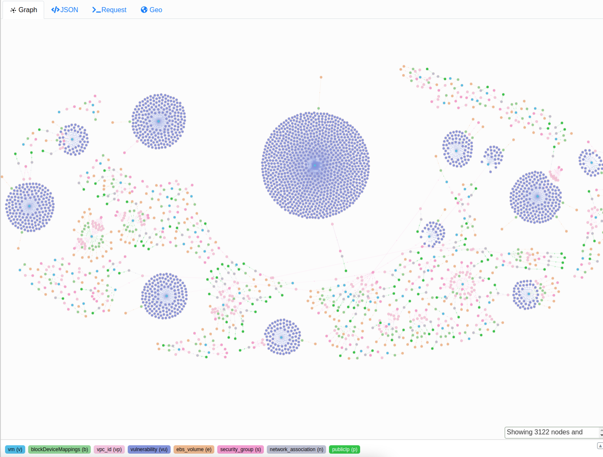

# PC-Graph
[](https://www.codefactor.io/repository/github/kyle9021/pc-graph)

Pulls from the Prisma Cloud API all the aws ec2 instances and the following associated data points:

* vulnerablities
* public ip addresses
* security groups
* vpcs
* ebs volumes
* iam permissions
* and more

Allows you to visualize and explore the data through a GraphQL interface with a backend Graph database. 



non-prod ready

* Deployed on Ubuntu 20.04 desktop 
* Requires jq, docker-compose, curl, bash, and docker


## Setup:


```bash
git clone https://github.com/kyle9021/pc-graph
cd pc-graph/
bash setup.sh
```

* open browser and go to http://localhost:8001/?local

### WAAS policy as Graph


* If you're interested in understanding the WAAS policies in a graphDB go to http://localhost:8001/?local
* On the lefthand menu click schema and then click "bulk edit".
* Check the box "Also drop Schema and Types" and in text field type `DROP ALL` and click "drop all"
* after the data has been cleared `bash waas_policy_etl.sh`


See the [Example writeup](./examples/jq-rdf-bash.md) for where I'd like to go with this
